# Azure DevOps - Hands-on Lab Script

Mark Harrison : 26 March 2020

- [Part 1 - Create Project / Application](azuredevops-1.md) ... this document
- [Part 2 - Development](azuredevops-2.md)
- [Part 3 - Test Plans](azuredevops-3.md)

## Overview

Azure DevOps provide rich and powerful tools everyone in the team can use to drive quality and collaboration throughout the development process. The easy-to-use, browser-based test management solution provides all the capabilities required for planned manual testing, user acceptance testing, exploratory testing, and gathering feedback from stakeholders.

## Create Project / Application sample

Use Azure DevOps Projects <https://portal.azure.com/#blade/HubsExtension/BrowseResource/resourceType/microsoft.visualstudio%2Faccount%2Fproject>

- Create a .NET project ... suggest use Windows AppService F1 free tier
  - Choose `.NET` | [Next]
  - Choose `ASP.NET Core` | [Next]
  - Choose `Windows Wep App` | [Next]
  - Enter details - webapp name must be unique, use local regions
  - Use the [Additional Settings] - select F1 free tier
  - [Done]

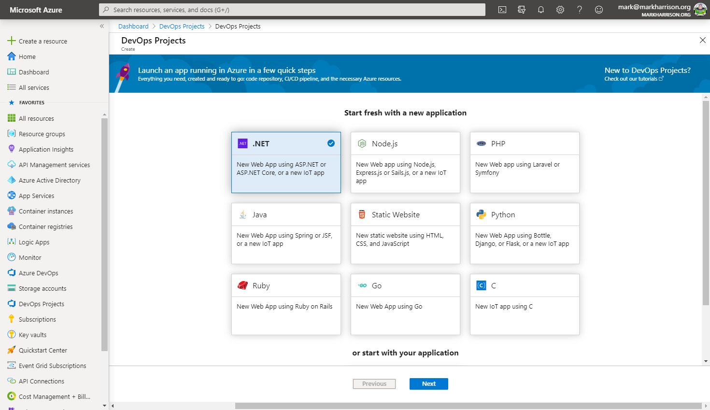

When the project has provisioned, the following has happenend:

- a sample application is stored in a Azure DevOps repo
- infrastructure as code ARM template is stored in the same Azure DevOps repo (different top level folder)
- build and release pipelines are generated, and invoked
- an Azure DevOps Project dashboard is generated.

IMPORTANT - temp fix to pipeline may be needed, see the section `Add .NET SDK` at the bottom of this document

Note on the Azure DevOps Project dashboard links to the AzureDevs homepage, repos, pipelines and boards.

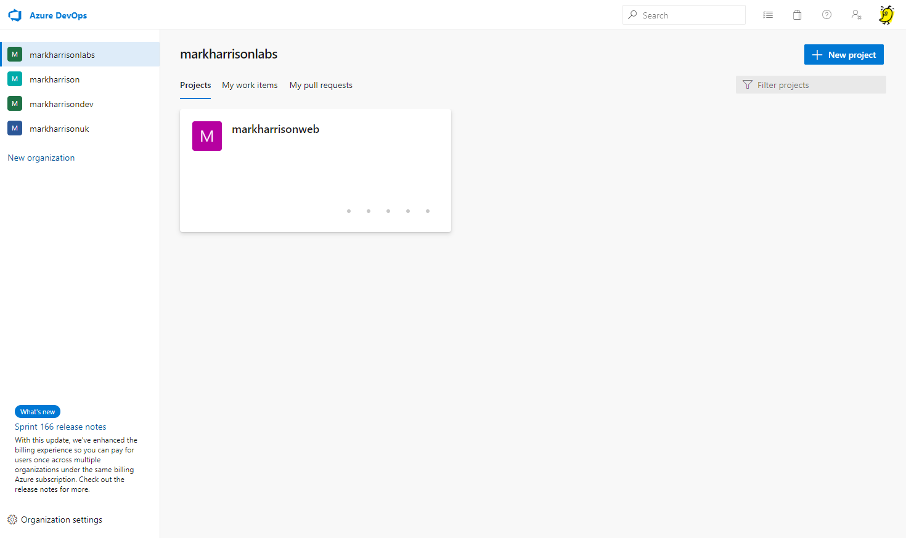

## Pipelines - Automated Testing

Also note on the Azure DevOps Project dashboard that the pipelines did some automated testing.

In the Build pipeline there was one unit test executed and this passed successfully.

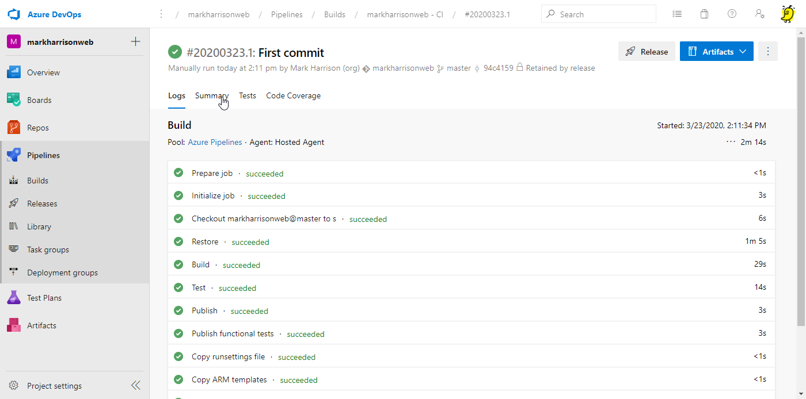

Also in the Release pipeline, there was one functional test executed and this passed successfully.

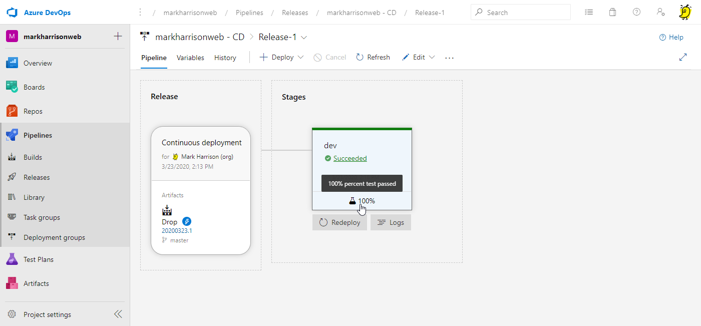

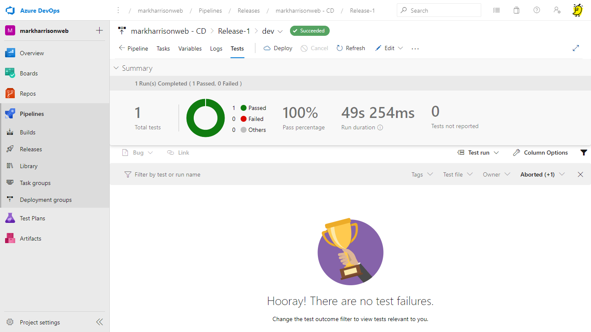

## Amend Pipelines

Make the following change to the Release pipeline ... this will be useful later.

- Select [Edit]

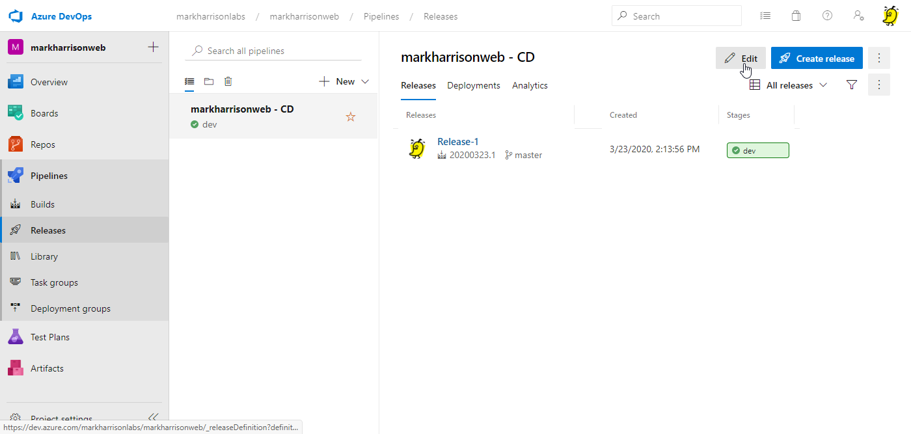

- Select [Options]

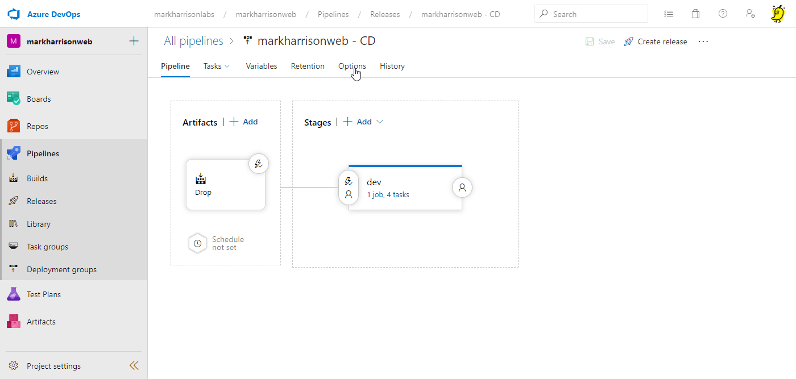

- Enable the Integrations :

  - Report deployment status to the repository host
  - Report deployment status to Work
  - Report deployment status to Boards
  - Enable the deployment status badge

- [Save]

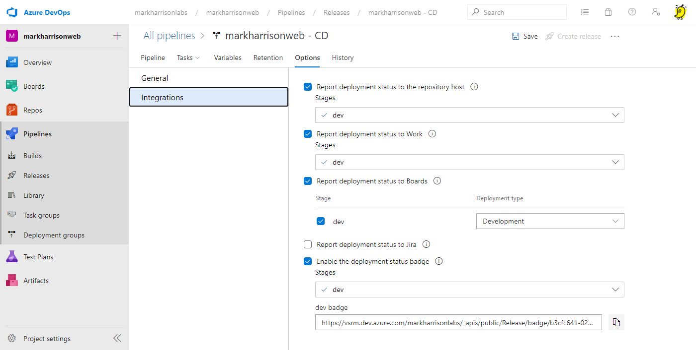

## Create WorkItems

Next we will create a User Story with two Tasks and two Test Cases.

- Go to WorkItems
- Create Story

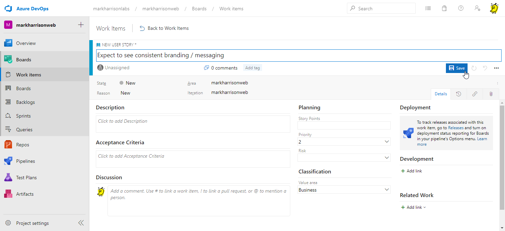

- Go to Boards

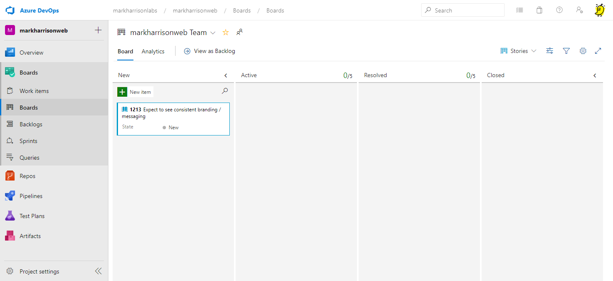

- Create two tasks:

- Create two test cases:

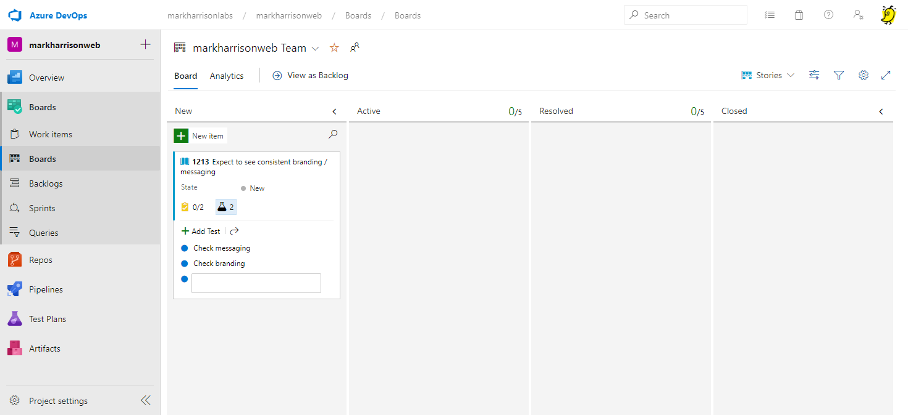

- Move story to Active

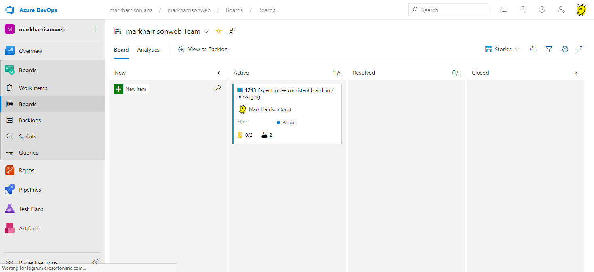

- Goto Backlogs
- Move story to Sprint1

## Add .NET SDK

Currently the sample app created is using .NET 2.2, but the Build Agent doesnt include .NET 2.2 as this version is at end of life.

To get the Pipeline to execute - add the following task into the pipeline, and specify SDK version 2.2.207

Similarly, add the same task (to add the .NET SDK 2.2.207) to the top of the Release pipeline.

This should be a temporary solution, until sample app is updated and the versions align.

## Summary

In this section we create our DevOps project and set up some work items.

In the next section we shall take on the persona of a developer, and make some code changes that relate to the work items.

---

[Home](README.md) | [Next](azuredevops-2.md)
